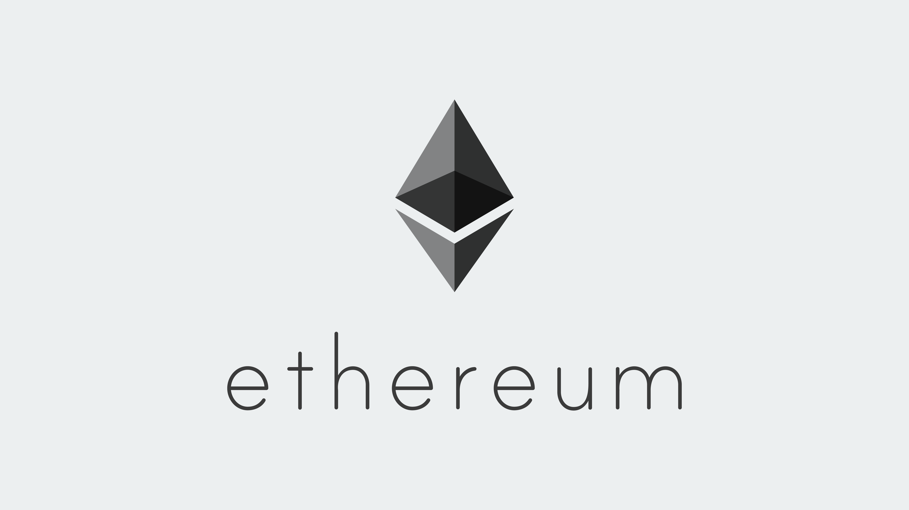

## BlockChain

### bitcoin

### ethereum

> 包含以太坊常用API分析/代码实战/代码分析文档/源代码中文解析/工具

### cosmos

> 包含tendermint

### fabric

### defi
> 分析Compound/PoolTogether/Uniswap主流DeFi开源的智能合约

### dapp
> ETH/EOS/TRON/IOST智能合约开发常用工具及网站

### tech
> 收录技术文章链接（来自链闻/巴比特/白话区块链等网站）

### 后续