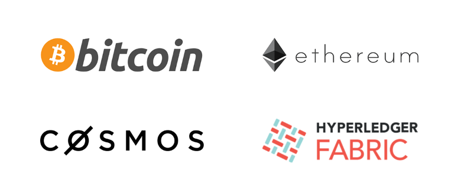

# BLOCKCHAIN

### bitcoin
> 液态网络(Liquid)/闪电网络(Lightning)/Schnorr/Taproot

### ethereum
> 以太坊常用API分析/代码实战/代码分析文档/源代码中文解析/工具

### cosmos
> tendermint/cosmos hub

### fabric
> fabric桌面版客户端/UI优化版的explorer

### defi
> Compound/PoolTogether/Uniswap主流DeFi开源的智能合约以及预言机ChainLink

### dapp
> ETH/EOS/TRON/IOST智能合约开发常用工具及网站

### go
> 常用框架以及知识点

### 后续
> FileCoin/Polkadot/Eth2.0等项目