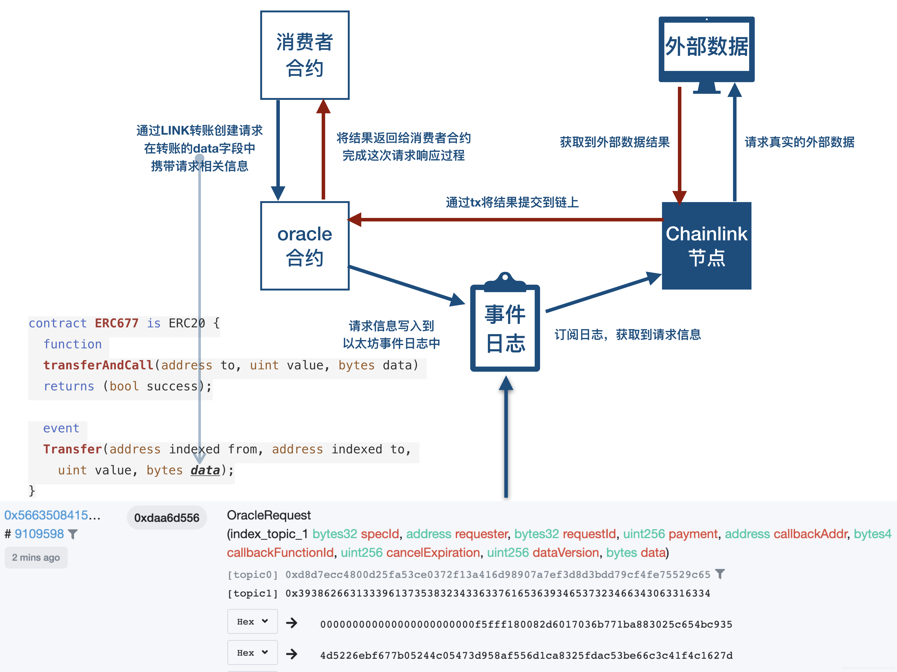

## [ChainLink](https://chain.link/)
  

**Methods:**  

名称 | 描述
----- | -----
setChainlinkOracle | 设置Oracle合同的存储地址
setChainlinkToken | 设置LINK令牌的存储地址
setPublicChainlinkToken | 设置检测到的公共网络的LINK令牌地址
buildChainlinkRequest | 使用必需的参数实例化一个Request对象
sendChainlinkRequest | 发送请求有效负载到存储为 chainlinkOracleAddress
sendChainlinkRequestTo | 向指定的oracle地址发送请求
validateChainlinkCallback | 保护履行回调，以确保仅由许可的发件人调用
addChainlinkExternalRequest | 允许链链接合同跟踪尚未创建的未满足请求
cancelChainlinkRequest | 取消试图联系无响应节点的Chainlink请求
useChainlinkWithENS | 通过ENS查找LINK令牌和Oracle合同的地址
updateOracleWithENS | 使用通过ENS解析的最新地址更新存储的Oracle地址
chainlinkTokenAddress | 返回LINK令牌的存储地址
chainlinkOracleAddress | 返回oracle合同的存储地址

**Example:**
```javascript
pragma solidity ^0.4.24;

import "@chainlink/contracts/src/v0.4/ChainlinkClient.sol";

// 继承导入的ChainLinkClient合约
contract ChainlinkExample is ChainlinkClient {
  // Stores the answer from the Chainlink oracle
  // 存放预言机价格
  uint256 public currentPrice;
  address public owner;

  constructor() public {
    // Set the address for the LINK token for the network
    // 
    setPublicChainlinkToken();
    owner = msg.sender;
  }

  // Creates a Chainlink request with the uint256 multiplier job
  function requestEthereumPrice(address _oracle, bytes32 _jobId, uint256 _payment) 
    public
    onlyOwner
  {
    // newRequest takes a JobID, a callback address, and callback function as input
    Chainlink.Request memory req = buildChainlinkRequest(_jobId, address(this), this.fulfill.selector);
    // Adds a URL with the key "get" to the request parameters
    // 添加请求的URL
    req.add("get", "https://min-api.cryptocompare.com/data/price?fsym=ETH&tsyms=USD");
    // Uses input param (dot-delimited string) as the "path" in the request parameters
    req.add("path", "USD");
    // Adds an integer with the key "times" to the request parameters
    req.addInt("times", 100);
    // Sends the request with the amount of payment specified to the oracle
    sendChainlinkRequestTo(_oracle, req, _payment);
  }

  // fulfill receives a uint256 data type
  function fulfill(bytes32 _requestId, uint256 _price)
    public
    // Use recordChainlinkFulfillment to ensure only the requesting oracle can fulfill
    recordChainlinkFulfillment(_requestId)
  {
    currentPrice = _price;
  }
  
  // cancelRequest allows the owner to cancel an unfulfilled request
  function cancelRequest(
    bytes32 _requestId,
    uint256 _payment,
    bytes4 _callbackFunctionId,
    uint256 _expiration
  )
    public
    onlyOwner
  {
    cancelChainlinkRequest(_requestId, _payment, _callbackFunctionId, _expiration);
  }

  
  // withdrawLink allows the owner to withdraw any extra LINK on the contract
  function withdrawLink()
    public
    onlyOwner
  {
    LinkTokenInterface link = LinkTokenInterface(chainlinkTokenAddress());
    require(link.transfer(msg.sender, link.balanceOf(address(this))), "Unable to transfer");
  }
  
  modifier onlyOwner() {
    require(msg.sender == owner);
    _;
  }
}
```

[Chainlink预言机基本原理](https://blog.csdn.net/ChainlinkO/article/details/103784697?depth_1-utm_source=distribute.pc_relevant_right.none-task&utm_source=distribute.pc_relevant_right.none-task)

