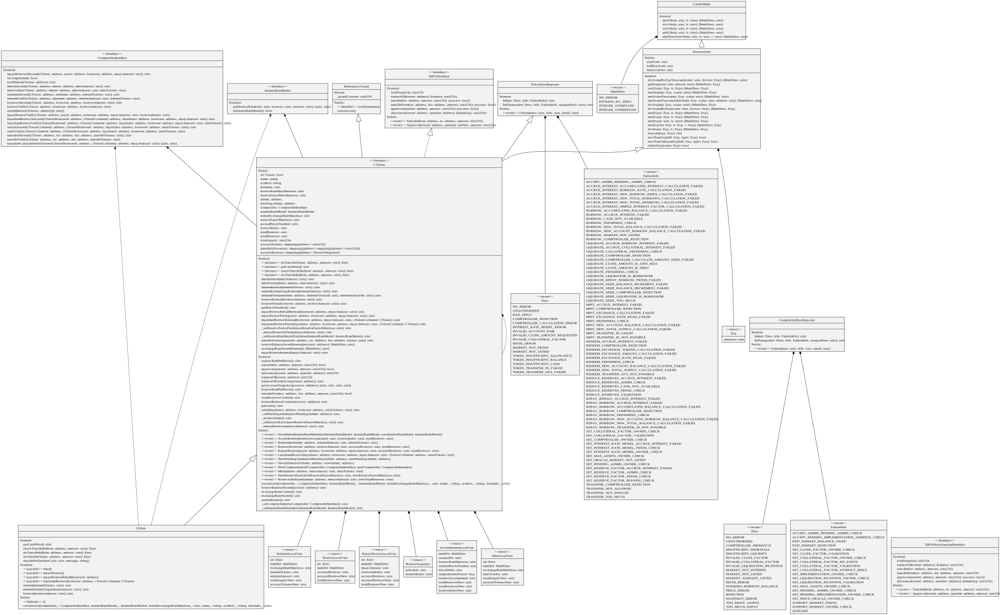

## Contracts
> 说明：节选合约到20.04.17版本，其中的信息可能已经有所发展或是发生改变

#### CToken, CErc20 and CEther
> 复合cToken，是独立的借贷合同，CToken包含核心逻辑，CErc20和CEther分别为Erc20令牌和ether添加公共接口

* cEther Solidity UML

#### Comptroller
> 风险模型合同，该合同验证允许的用户操作，如果不符合某些风险参数，则禁止操作。 例如，主计长强制要求每个借用用户必须在所有cToken上保持足够的抵押物余额

* Comptroller Solidity UML

#### Comp
> Compound治理代币(COMP),该代币的持有者可以通过调控者合同来调控协议

#### Governor Alpha
> Compound时间锁合同的管理员，Comp令牌的持有者可以创建提案并对其进行投票，这些提案将排队进入化合物时间锁，然后对化合物cToken和Copmtroller合同产生影响。 该合同将来可能会被Beta版本取代。

#### InterestRateModel
> 定义利率模型的合同，这些模型根据给定市场的当前利用率（即所提供的资产中有多少是流动的还是借来的）在算法上确定利率

#### Careful Math
> 安全数学计算库

#### ErrorReporter
> 跟踪错误代码和故障情况

#### Exponential
> 处理定点十进制数字

#### SafeToken
> 安全地处理Erc20交互

#### WhitePaperInterestRateModel
> 初始利率模型，如白皮书中所定义，该合约在其构造函数中接受基本费率和斜率参数