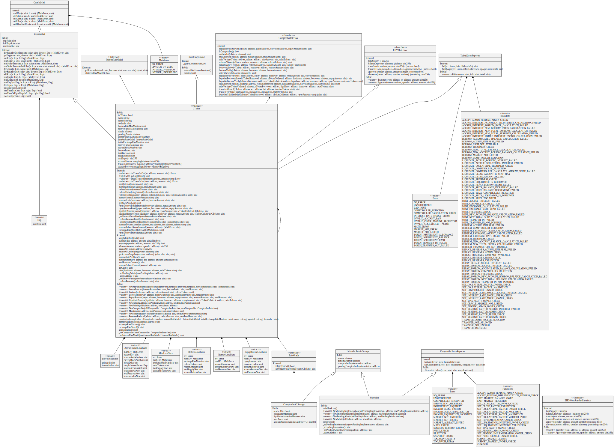

## Contracts

#### CToken, CErc20 and CEther
The Compound cTokens, which are self-contained borrowing and lending contracts. CToken contains the core logic and CErc20 and CEther add public interfaces for Erc20 tokens and ether, respectively. Each CToken is assigned an interest rate and risk model (see InterestRateModel and Comptroller sections), and allows accounts to *mint* (supply capital), *redeem* (withdraw capital), *borrow* and *repay a borrow*. Each CToken is an ERC-20 compliant token where balances represent ownership of the market.
#### Comptroller
The risk model contract, which validates permissible user actions and disallows actions if they do not fit certain risk parameters. For instance, the Comptroller enforces that each borrowing user must maintain a sufficient collateral balance across all cTokens.
* Comptroller Solidity UML

#### Comp
The Compound Governance Token (COMP). Holders of this token have the ability to govern the protocol via the governor contract.
#### Governor Alpha
The administrator of the Compound timelock contract. Holders of Comp token may create and vote on proposals which will be queued into the Compound timelock and then have effects on Compound cToken and Copmtroller contracts. This contract may be replaced in the future with a beta version.
#### InterestRateModel
Contracts which define interest rate models. These models algorithmically determine interest rates based on the current utilization of a given market (that is, how much of the supplied assets are liquid versus borrowed).
#### Careful Math
Library for safe math operations.
#### ErrorReporter
Library for tracking error codes and failure conditions.
#### Exponential
Library for handling fixed-point decimal numbers.
#### SafeToken
Library for safely handling Erc20 interaction.
#### WhitePaperInterestRateModel
Initial interest rate model, as defined in the Whitepaper. This contract accepts a base rate and slope parameter in its constructor.