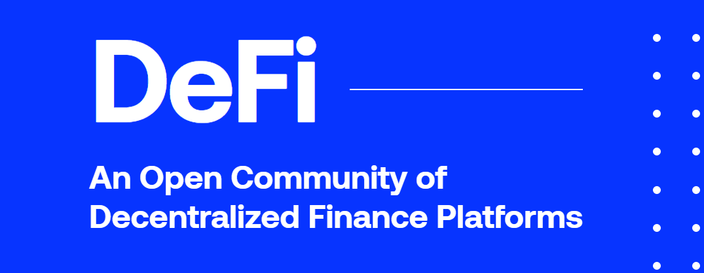

### DEFI主流平台 => [DefiPulse](https://defipulse.com/)

* [Maker](https://makerdao.com/)
> MakerDAO是以太坊上的去中心化信用平台，支持以美元为单位的稳定币Dai。任何人都可以使用Maker打开保险柜，锁定ETH或BAT等抵押品，并产生Dai作为对该抵押品的债务。族债务会产生稳定费（即不断产生的利息），该费用在偿还借入的Dai族时支付。那个MKR和还清的Dai一起被烧掉了。用户最多可以借入Dai抵押品价值的66％（抵押率150％）。低于该比率的CDP将受到13％的罚款和清算（任何人），以使CDP脱离违约状态。清算抵押品在公开市场上以3％的折扣出售。Maker的其他令牌（MKR）的持有者通过对风险参数（例如稳定费水平）进行投票来管理系统。发生黑天鹅事件时，MKR持有人还充当最后一道防线。如果系统范围内的抵押品价值下降得太低，太快​​，MKR将被铸造并在公开市场上出售以筹集更多抵押品，从而稀释MKR持有者。Maker还具有称为Dai储蓄率（DSR）的功能。DAI持有者可以将其DAI锁定在Maker的DSR合同中，并从稳定费用中获得DAI的可变利率。

* [Compound](https://compound.finance/)
> Compound是在以太坊上的一种算法货币市场协议，它允许用户赚取利息或抵押资产。任何人都可以将资产提供给Compound的流动资金池，并立即开始赚取持续不断的利息。价格会根据供求情况自动调整。提供的资产余额用cTokens表示：赚取利息并用作抵押品的基础资产的表示。根据基础资产的质量，用户最多可以借入其cToken价值的50-75％。用户可以随时添加或删除资金，但是如果他们的债务抵押不足，任何人都可以清算；清算资产的5％折扣可以激励清算人。Compound协议拨出已付利息的10％作为储备金；其余的交给供应商。Compound最初于2018年9月在主网上发布，并于2019年5月升级到v2。该协议现在支持BAT，DAI，SAI，ETH，REP，USDC，WBTC和ZRX。Compound的合约已通过审核并正式验证。从2020年3月开始，COMP计划引入由新的COMP控制的治理系统。

* [Synthetix](https://www.synthetix.io/)
> Synthetix是在以太坊上的去中心化平台，用于创建Synths：跟踪现实世界资产价值的链上合成资产。作为稳定币项目Havven诞生的，Synthetix进行了品牌重塑并扩展了其范围，然后于2019年2月在主网上发布。截至2020年3月，Synthetix平台支持代表法定货币，大宗商品（例如黄金）和加密资产的30多种Synths。股票，指数和其他衍生工具已计划。Synthetix具有一个称为SNX的本地令牌。持有人可以将诸如SNX和ETH之类的抵押品锁定为铸造的Synths，后者是可自由交易的ERC20代币。在Synthetix的非托管DEX（Synthetix.Exchange）上交换的Synth交易费转给SNX持有者/ Synth造币商，激励Synth的创建并为基础抵押品（即SNX代币）赋予价值。

* [UniSwap](https://uniswap.org/)
> Uniswap是一种完全分散的链上协议，用于在以太坊上进行代币交换，它使用流动资金池代替订单簿。任何人都可以在ETH与任何ERC20代币之间快速交换或通过提供任何数量的流动性来赚取费用。任何人都可以通过提供相等价值的ETH和ERC20代币来创建市场（即流动性池）。Uniswap的每个ERC20令牌仅允许一个市场。市场创建者设定汇率，这要归功于Uniswap的“恒定产品做市商”机制。当交易减少了该货币对的一方相对于另一方的流动性时，价格就会发生变化。这创造了套利机会，鼓励了更多交易。Uniswap没有本机令牌，但是每个流动性对都由唯一的，可自由转让的ERC20令牌表示。所有费用（0。每笔交易3％）添加到相关的流动资金池中；因此，所有费用都按流动资金提供者在资金池流动资金中所占的比例分配给流动资金提供者。流动性提供者可以随时添加或提取资金。随着更大的价格变动，流动性提供者将遭受“无常损失”。随着价格回到提供流动性时的水平，损失减少了。如果有足够的交易量，所赚取的费用可以抵消这一损失。

* [PoolTogether](https://www.pooltogether.com/)
> DeFi无损彩票平台

### 目前存在的风险

* 智能合约风险

* 中心化单点故障风险

* 银行挤兑风险（流动性危机风险）

* 价格预言机风险

### 相关科普文章

* [借贷平台 Compound 发行治理代币COMP](https://www.chainnews.com/articles/583919445592.htm)

* [零基础入门 DeFi：手把手教你在 Uniswap 交易甚至上币](https://www.chainnews.com/articles/522868612900.htm)

* [零基础入门 DeFi：手把手教你通过 Compound 平台借贷](https://www.chainnews.com/articles/342807799418.htm)

* [一文教你用 MakerDAO 和 Compound 赚利息](https://www.chainnews.com/articles/815477699742.htm)

* [五分钟读懂永不崩盘的 DeFi 彩票游戏 PoolTogether](https://www.chainnews.com/articles/591512482032.htm)

* [解读 DeFi 项目存续之道：代币化与收费模式](https://www.chainnews.com/articles/430512624894.htm)