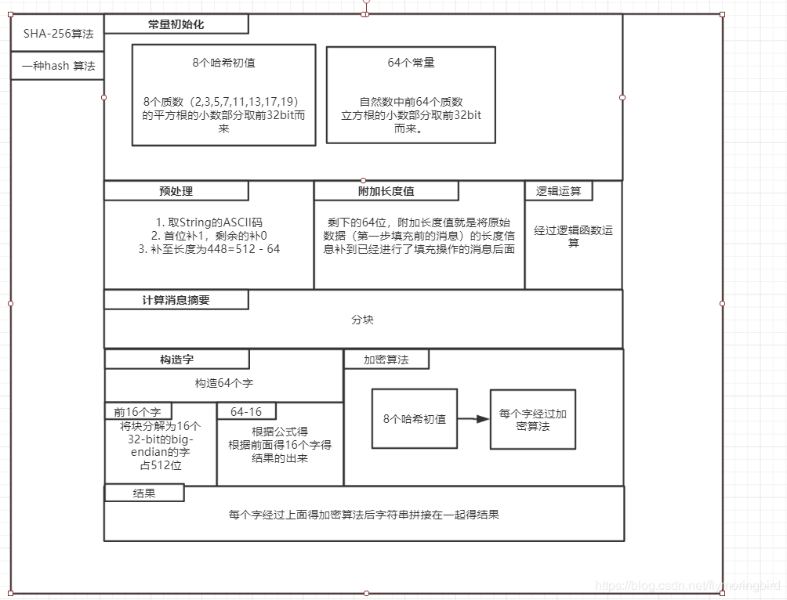

## SHA

### SHA2 -> [SHA256](https://zhuanlan.zhihu.com/p/94619052)

**GO语言使用SHA256:**

```go
//方法一
func digest1(data []byte)([]byte,error){
	h := sha256.Sum256(data)
	return h[:],nil
}

//方法二
func digest2(data []byte) ([]byte, error) {
	h := sha256.New()
	h.Write(data)

	return h.Sum(nil),nil
}
```
**GO语言原理过程实现:**


```go
package main

import (
	"encoding/binary"
)

func wikiSha256(message []byte) [32]byte {
    //初始哈希值
	h0 := uint32(0x6a09e667)
	h1 := uint32(0xbb67ae85)
	h2 := uint32(0x3c6ef372)
	h3 := uint32(0xa54ff53a)
	h4 := uint32(0x510e527f)
	h5 := uint32(0x9b05688c)
	h6 := uint32(0x1f83d9ab)
	h7 := uint32(0x5be0cd19)
    
    //计算过程当中用到的常数
	k := [64]uint32{
                0x428a2f98, 0x71374491, 0xb5c0fbcf, 0xe9b5dba5, 0x3956c25b, 0x59f111f1, 0x923f82a4, 0xab1c5ed5,
		0xd807aa98, 0x12835b01, 0x243185be, 0x550c7dc3, 0x72be5d74, 0x80deb1fe, 0x9bdc06a7, 0xc19bf174,
		0xe49b69c1, 0xefbe4786, 0x0fc19dc6, 0x240ca1cc, 0x2de92c6f, 0x4a7484aa, 0x5cb0a9dc, 0x76f988da,
		0x983e5152, 0xa831c66d, 0xb00327c8, 0xbf597fc7, 0xc6e00bf3, 0xd5a79147, 0x06ca6351, 0x14292967,
		0x27b70a85, 0x2e1b2138, 0x4d2c6dfc, 0x53380d13, 0x650a7354, 0x766a0abb, 0x81c2c92e, 0x92722c85,
		0xa2bfe8a1, 0xa81a664b, 0xc24b8b70, 0xc76c51a3, 0xd192e819, 0xd6990624, 0xf40e3585, 0x106aa070,
		0x19a4c116, 0x1e376c08, 0x2748774c, 0x34b0bcb5, 0x391c0cb3, 0x4ed8aa4a, 0x5b9cca4f, 0x682e6ff3,
		0x748f82ee, 0x78a5636f, 0x84c87814, 0x8cc70208, 0x90befffa, 0xa4506ceb, 0xbef9a3f7, 0xc67178f2}
    
	padded := append(message, 0x80)
	if len(padded) % 64 < 56 {
		suffix := make([]byte, 56 - (len(padded) % 64))
		padded = append(padded, suffix...)
	} else {
		suffix := make([]byte, 64 + 56 - (len(padded) % 64))
		padded = append(padded, suffix...)
	}
	msgLen := len(message) * 8
	bs := make([]byte, 8)
	binary.BigEndian.PutUint64(bs, uint64(msgLen))
	padded = append(padded, bs...)

	broken := [][]byte{};
    
	for i := 0; i < len(padded) / 64; i++ {
		broken = append(broken, padded[i * 64: i * 64 + 63])
	}
    
    //主循环
	for _, chunk := range broken {
		w := []uint32{}
        
		for i := 0; i < 16; i++ {
			w = append(w, binary.BigEndian.Uint32(chunk[i * 4:i * 4 + 4]))
		}
		w = append(w, make([]uint32, 48)...)
        
        //W消息区块处理
		for i := 16; i < 64; i++ {
			s0 := rightRotate(w[i - 15], 7) ^ rightRotate(w[i - 15], 18) ^ (w[i - 15] >> 3)
			s1 := rightRotate(w[i - 2], 17) ^ rightRotate(w[i - 2], 19) ^ (w[i - 2] >> 10)
			w[i] = w[i - 16] + s0 + w[i - 7] + s1
		}

		a := h0
		b := h1
		c := h2
		d := h3
		e := h4
		f := h5
		g := h6
		h := h7
        
        //应用SHA256压缩函数更新a,b,...,h
		for i := 0; i < 64; i++ {
			S1 := rightRotate(e, 6) ^ rightRotate(e, 11) ^ rightRotate(e, 25)
			ch := (e & f) ^ ((^e) & g)
			temp1 := h + S1 + ch + k[i] + w[i]
			S0 := rightRotate(a, 2) ^ rightRotate(a, 13) ^ rightRotate(a, 22)
			maj := (a & b) ^ (a & c) ^ (b & c)
			temp2 := S0 + maj

			h = g
			g = f
			f = e
			e = d + temp1
			d = c
			c = b
			b = a
			a = temp1 + temp2
		}
        
		h0 = h0 + a
		h1 = h1 + b
		h2 = h2 + c
		h3 = h3 + d
		h4 = h4 + e
		h5 = h5 + f
		h6 = h6 + g
		h7 = h7 + h
	}
	hashBytes := [][]byte{iToB(h0), iToB(h1), iToB(h2), iToB(h3), iToB(h4), iToB(h5), iToB(h6), iToB(h7)}
	hash := []byte{}
	hashArray := [32]byte{}
	for i := 0; i < 8; i ++ {
		hash = append(hash, hashBytes[i]...)
	}
	copy(hashArray[:], hash[0:32])
	return hashArray
}

func iToB(i uint32) []byte {
	bs := make([]byte, 4)
	binary.BigEndian.PutUint32(bs, i)
	return bs
}

//循环右移函数
func rightRotate(n uint32, d uint) uint32 {
	return (n >> d) | (n << (32 - d))
}
```

