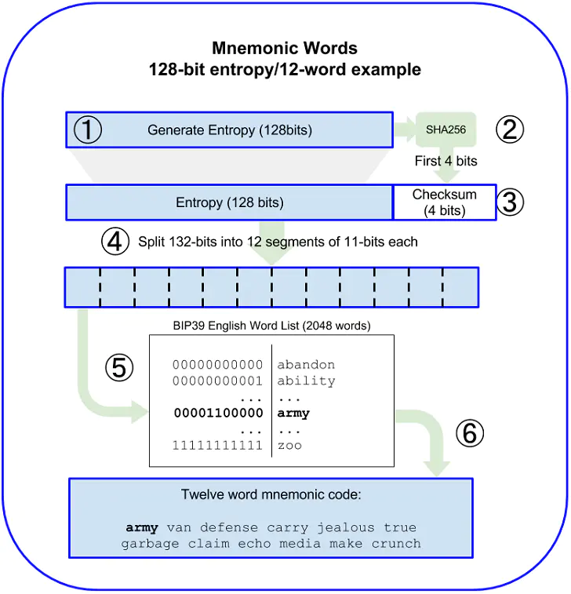

## Key

### Mnemonic 助记词(bip39.go)  

**生成过程:**  

1.随机生成 128 bits 的 seed (需是32的倍数)  
2.将 seed 进行hash256运算，获取hash值 开头的 4个 bits，与 seed 组成一个组新数值  
3.以11bits为单位，拆分 上组新数值，每 11bits 个数值 转成一个10进制数  
4.用这个十进制数 作为 助记词单词数组 的下标，获取 对应的 一个单词作为 助记词  
5.一共12组11bits数，所以 生成 12个 单词  



**关键函数:**  

```go
// 创建随机熵字节,生成12个助记词需要键入bitSize为128,依此类推

func NewEntropy(bitSize int) ([]byte, error) {
	err := validateEntropyBitSize(bitSize)
	if err != nil {
		return nil, err
	}

	entropy := make([]byte, bitSize/8)
	_, err = rand.Read(entropy)
	return entropy, err
}

// 根据上面生成的熵字节计算出对应的助记词

func NewMnemonic(entropy []byte) (string, error) {
	// Compute some lengths for convenience.
	entropyBitLength := len(entropy) * 8
	checksumBitLength := entropyBitLength / 32
	sentenceLength := (entropyBitLength + checksumBitLength) / 11

	// Validate that the requested size is supported.
	err := validateEntropyBitSize(entropyBitLength)
	if err != nil {
		return "", err
	}

	// Add checksum to entropy.
	entropy = addChecksum(entropy)

	// Break entropy up into sentenceLength chunks of 11 bits.
	// For each word AND mask the rightmost 11 bits and find the word at that index.
	// Then bitshift entropy 11 bits right and repeat.
	// Add to the last empty slot so we can work with LSBs instead of MSB.

	// Entropy as an int so we can bitmask without worrying about bytes slices.
	entropyInt := new(big.Int).SetBytes(entropy)

	// Slice to hold words in.
	words := make([]string, sentenceLength)

	// Throw away big.Int for AND masking.
	word := big.NewInt(0)

	for i := sentenceLength - 1; i >= 0; i-- {
		// Get 11 right most bits and bitshift 11 to the right for next time.
		word.And(entropyInt, last11BitsMask)
		entropyInt.Div(entropyInt, shift11BitsMask)

		// Get the bytes representing the 11 bits as a 2 byte slice.
		wordBytes := padByteSlice(word.Bytes(), 2)

		// Convert bytes to an index and add that word to the list.
		words[i] = wordList[binary.BigEndian.Uint16(wordBytes)]
	}

	return strings.Join(words, " "), nil
}

// 添加校验和

func addChecksum(data []byte) []byte {
	// Get first byte of sha256
	hash := computeChecksum(data)
	firstChecksumByte := hash[0]

	// len() is in bytes so we divide by 4
	checksumBitLength := uint(len(data) / 4)

	// For each bit of check sum we want we shift the data one the left
	// and then set the (new) right most bit equal to checksum bit at that index
	// staring from the left
	dataBigInt := new(big.Int).SetBytes(data)
	for i := uint(0); i < checksumBitLength; i++ {
		// Bitshift 1 left
		dataBigInt.Mul(dataBigInt, bigTwo)

		// Set rightmost bit if leftmost checksum bit is set
		if uint8(firstChecksumByte&(1<<(7-i))) > 0 {
			dataBigInt.Or(dataBigInt, bigOne)
		}
	}

	return dataBigInt.Bytes()
}

// 计算校验和

func computeChecksum(data []byte) []byte {
	hasher := sha256.New()
	hasher.Write(data)
	return hasher.Sum(nil)
}
```
### PrivateKey 私钥 PublicKey 公钥 Address 地址
```go
package main

import (
"fmt"
"log"

"github.com/miguelmota/go-ethereum-hdwallet"
)

func main() {
	mnemonic := "tag volcano eight thank tide danger coast health above argue embrace heavy"
	wallet, err := hdwallet.NewFromMnemonic(mnemonic)
	if err != nil {
		log.Fatal(err)
	}

	path := hdwallet.MustParseDerivationPath("m/44'/60'/0'/0/0")
	account, err := wallet.Derive(path, false)
	if err != nil {
		log.Fatal(err)
	}

	privateKey, _ := wallet.PrivateKeyHex(account)
	publicKey, _ := wallet.PublicKeyHex(account)
	fmt.Println(privateKey) // 0x63e21d10fd50155dbba0e7d3f7431a400b84b4c2ac1ee38872f82448fe3ecfb9
	fmt.Println(publicKey) // 0x026005c86a6718f66221713a77073c41291cc3abbfcd03aa4955e9b2b50dbf7f9b
	fmt.Println(account.Address.Hex()) // 0xC49926C4124cEe1cbA0Ea94Ea31a6c12318df947
}
```