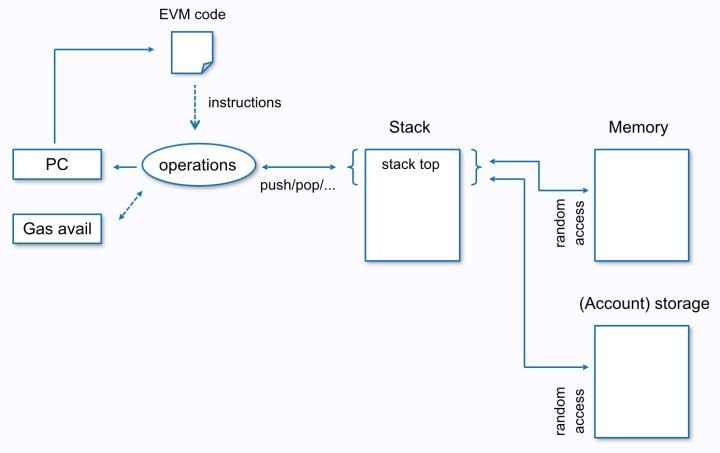
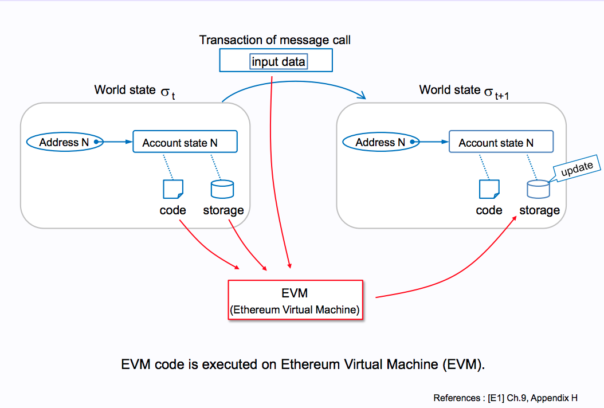

# EVM Overview
## 1. 设计目标

在以太坊的设计原理中描述了 EVM 的设计目标:

- 简单：操作码尽可能的简单，低级，数据类型尽可能少，虚拟机结构尽可能少。
- 结果明确：在 VM 规范里，没有任何可能产生歧义的空间，结果应该是完全确定的，此外，计算步骤应该是精确的，以便可以计量 gas 消耗量。
- 节约空间：EVM 汇编码应该尽可能紧凑。
- 预期应用应具备专业化能力：在 VM 上构建的应用能够处理20字节的地址，以及32位的自定义加密值，拥有用于自定义加密的模数运算、读取区块和交易数据和状态交互等能力。
- 简单安全：能够容易地建立一套操作的 gas 消耗成本模型，让 VM 不被利用。
- 优化友好：应该易于优化，以便即时编译(JIT)和 VM 的加速版本能够构建出来。

## 2. 特点：

- 区分临时存储（Memory，存在于每个 VM 实例中，并在 VM 执行结束后消失）和永久存储（Storage，存在于区块链的状态层）。
- 采用基于栈（stack）的架构。
- 机器码长度为32字节。
- 没有重用 Java，或其他一些 Lisp 方言，Lua 的虚拟机，自定义虚拟机。
- 使用可变的可扩展内存大小。
- 限制调用深度为 1024。
- 没有类型。

## 3. 原理
通常智能合约的开发流程是使用 solidity 编写逻辑代码，通过编译器编译成 bytecode，然后发布到以太坊上，以太坊底层通过 EVM 模块支持合约的执行和调用，调用时根据合约地址获取到代码，即合约的字节码，生成环境后载入到 EVM 执行。

大致流程如下图1，指令的执行过程如下图2，从 EVM code 中不断取出指令执行，利用 Gas 来实现限制循环，利用栈来进行操作，内存存储临时变量，账户状态中的 storage 用来存储数据。

## 4. 代码结构
EVM 模块的文件比较多，这里先给出每个文件的简述，先对每个文件提供的功能有个简单的了解。
<pre><code>
├── analysis.go            // 跳转目标判定
├── common.go
├── contract.go            // 合约的数据结构
├── contracts.go           // 预编译好的合约
├── errors.go
├── evm.go                 // 对外提供的接口   
├── gas.go                 // 用来计算指令耗费的 gas
├── gas_table.go           // 指令耗费计算函数表
├── gen_structlog.go       
├── instructions.go        // 指令操作
├── interface.go           // 定义 StateDB 的接口
├── interpreter.go         // 解释器
├── intpool.go             // 存放大整数
├── int_pool_verifier_empty.go
├── int_pool_verifier.go
├── jump_table.go           // 指令和指令操作（操作，花费，验证）对应表
├── logger.go               // 状态日志
├── memory.go               // EVM 内存
├── memory_table.go         // EVM 内存操作表，用来衡量操作所需内存大小
├── noop.go
├── opcodes.go              // 指令以及一些对应关系     
├── runtime
│   ├── env.go              // 执行环境 
│   ├── fuzz.go
│   └── runtime.go          // 运行接口，测试使用
├── stack.go                // 栈
└── stack_table.go          // 栈验证</code></pre>

