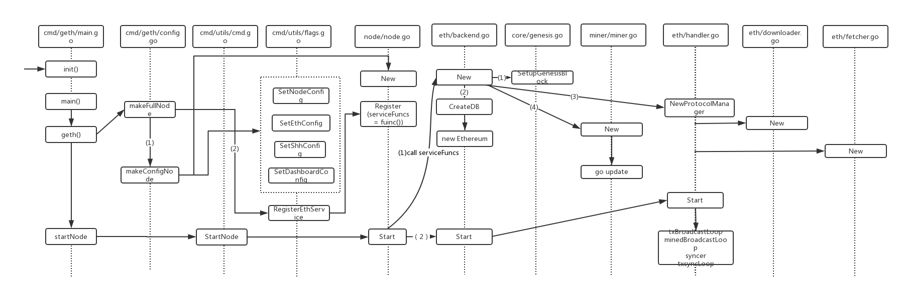

## POS

### 公链修改
* ethport 30303 rpcport 8545
* chainid/networkid 均为 209 networkid(eth/config.go#L46) chainid(params/config.go#L53)
* alloc coinbase
* MasterndeContractAddress GovernanceContractAddress ShardingAddress(eth/config.go#L33~35)
* Period(平均出块时间params/protocol_params.go#L95) 5s
* blockReward(区块奖励 consensus/devote#L57)
* GenesisBlockNumber(创世区块高度eth/config.go#L37) Genesis->Timestamp(core/genesis.go#L327)