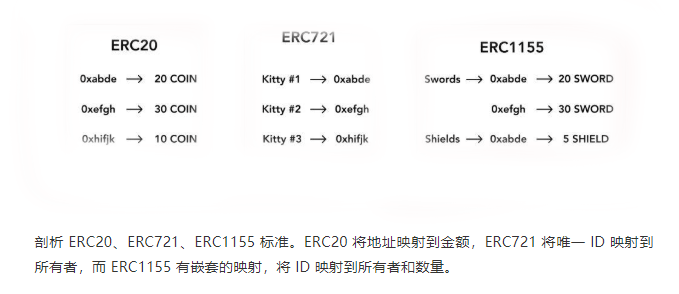

## Smart Contact(Solidity)
> 以太坊智能合约编写涉及大量工具的运用，安全的审计以及上线的风险

### 智能合约安全标准
* [OpenZeppelin](https://github.com/OpenZeppelin)
> The standard for secure blockchain applications.

### 官方调试网站
* [Remix](https://remix.ethereum.org/)

### 常用智能合约及对应文件
* Erc20 -> erc20.sol
* Erc721 -> erc721.sol 
* Erc1155 -> erc1155.sol

* AirDrop -> Wip-AirDrop(带初始参数合约)/De-AirDrop(数据输入型合约)
* Lock -> 锁仓合约包含线性释仓/定时释仓(这部分比较简单，不过多介绍)
* DeFi -> 这部分主目录defi那里分析吧
* Game -> 这部分主目录dapp那里分享吧

### ABI
> 见abi.md

### 合约初始化参数字节码
> Input Data的字节码最后面的即为初始化参数

### 合约内切勿转入USDT
> USDT(Erc20代码版本较早 有兼容性问题 目前合约内转账USDT是会失败的)
